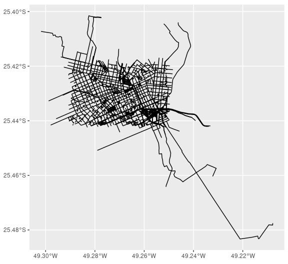
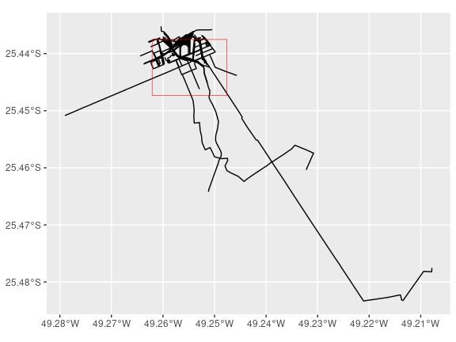

# rosmium

[](https://CRAN.R-project.org/package=rosmium)
[](https://github.com/ipeaGIT/rosmium/actions?query=workflow%3Acheck)
[](https://app.codecov.io/gh/ipeaGIT/rosmium?branch=main)
[](https://lifecycle.r-lib.org/articles/stages.html)

**rosmium** allows one to use [Osmium
Tool](https://osmcode.org/osmium-tool/) from R. Osmium is a multipurpose
command line tool that enables one to manipulate and analyze
OpenStreetMap (OSM) files through several different commands. Currently,
this package does not aim to offer functions that cover the entirety of
Osmium’s API, instead making available functions that wrap only a very
limited set of Osmium’s features.

## Installation

Development version:

``` r
# install.packages("remotes")
remotes::install_github("ipeaGIT/rosmium")
```

Please note that **rosmium** requires Osmium to be installed and added
to the PATH environment variable of your local system. For instructions
on how to install Osmium, please check [its official
website](https://osmcode.org/osmium-tool/#download).

## Usage

The package currently includes only three entrypoints to Osmium’s API.
To demonstrate them, we will use some sample data bundled with the
package.

``` r
library(rosmium)
library(ggplot2)

cur_pbf <- system.file("extdata/cur.osm.pbf", package = "rosmium")

cur_pbf_lines <- sf::st_read(cur_pbf, layer = "lines", quiet = TRUE)

ggplot(cur_pbf_lines) + geom_sf()
```

<!-- -->

### `extract()`

`extract()` creates geographical extracts from OSM files. In its most
basic form, the function takes the path to the OSM file whose
geographical extent should be extracted from, the extent, either as a
bounding box or as a (multi)polygon, and the path to the file where the
output should be written to. Additionally, the function can also take
the strategy to be used when creating the extract, which defaults to
`"complete_ways"`. Please check the function documentation for details
on the available strategies and their behavior.

``` r
# buffering the pbf bounding box 4000 meters inward and using the result
# extent to extract the osm data inside it. transforming the crs because
# inward buffers only work with projected crs

bbox <- sf::st_bbox(cur_pbf_lines)
bbox_polygon <- sf::st_as_sf(sf::st_as_sfc(bbox))
smaller_bbox_poly <- sf::st_buffer(sf::st_transform(bbox_polygon, 5880), -4000)
smaller_bbox_poly <- sf::st_transform(smaller_bbox_poly, 4326)

output_path <- extract(
  cur_pbf,
  smaller_bbox_poly,
  tempfile(fileext = ".osm.pbf"),
  spinner = FALSE
)

extracted_pbf_lines <- sf::st_read(output_path, layer = "lines", quiet = TRUE)

ggplot() +
  geom_sf(data = extracted_pbf_lines) +
  geom_sf(data = smaller_bbox_poly, color = "red", fill = NA)
```

<!-- -->

### `tags_filter()`

`tags_filter()` filters OSM files, keeping objects matching at least one
of the specified expressions from the input. In its most basic form, the
function takes the path to the OSM file to which the filters should be
applied, the filter expressions that should be applied and the path to
the file where the output should be written to. Please check the
function documentation for a description of the filter expression
format.

By default, not only the objects matching the expressions will be kept
in the output, but also the objects referenced by them. This behavior
can be changed with the `omit_referenced` parameter. The function also
includes the `invert_match` parameter, that inverts the sense of
matching (excluding objects that match the filters), and the
`remove_tags` parameter, used to remove tags from objects that are
referenced by objects matching the filters, but which do not match the
filter themselves. Both arguments default to `FALSE`.

``` r
# get all amenity nodes
output <- tags_filter(cur_pbf, "n/amenity", tempfile(fileext = ".osm.pbf"))
#> - 
nodes <- sf::st_read(output, layer = "points", quiet = TRUE)
head(nodes$other_tags)
#> [1] "\"amenity\"=>\"university\",\"wikidata\"=>\"Q10278991\""                                                                  
#> [2] "\"amenity\"=>\"telephone\",\"operator\"=>\"OI\",\"payment:telephone_cards\"=>\"yes\""                                     
#> [3] "\"amenity\"=>\"kindergarten\""                                                                                            
#> [4] "\"addr:housenumber\"=>\"45\",\"addr:street\"=>\"Rua Amintas de Barros\",\"amenity\"=>\"restaurant\",\"cuisine\"=>\"arab\""
#> [5] "\"addr:city\"=>\"Curitiba\",\"addr:housenumber\"=>\"1250\",\"addr:street\"=>\"Rua 7 de Abril\",\"amenity\"=>\"pub\""      
#> [6] "\"amenity\"=>\"taxi\""

# get all objects (nodes, ways or relations) with an addr:* tag
output <- tags_filter(
  cur_pbf,
  "addr:*",
  tempfile(fileext = ".osm.pbf"),
  omit_referenced = TRUE,
  spinner = FALSE
)
nodes <- sf::st_read(output, layer = "points", quiet = TRUE)
head(nodes$other_tags)
#> [1] "\"addr:city\"=>\"Curitiba\",\"addr:housenumber\"=>\"358\",\"addr:postcode\"=>\"80510-190\",\"addr:street\"=>\"Rua Mateus Leme\",\"addr:suburb\"=>\"Centro Cívico\",\"brand\"=>\"Ibis\",\"brand:wikidata\"=>\"Q920166\",\"brand:wikipedia\"=>\"en:Ibis (hotel)\",\"tourism\"=>\"hotel\""
#> [2] "\"addr:city\"=>\"Curitiba\",\"addr:country\"=>\"BR\",\"addr:housenumber\"=>\"1975\",\"addr:street\"=>\"Avenida Marechal Deodoro\""                                                                                                                                                     
#> [3] "\"addr:city\"=>\"Curitiba\",\"addr:country\"=>\"BR\",\"addr:housenumber\"=>\"2085\",\"addr:street\"=>\"Avenida Marechal Deodoro\""                                                                                                                                                     
#> [4] "\"addr:city\"=>\"Curitiba\",\"addr:country\"=>\"BR\",\"addr:housenumber\"=>\"1976\",\"addr:street\"=>\"Avenida Marechal Deodoro\""                                                                                                                                                     
#> [5] "\"addr:city\"=>\"Curitiba\",\"addr:country\"=>\"BR\",\"addr:housenumber\"=>\"2086\",\"addr:street\"=>\"Avenida Marechal Deodoro\""                                                                                                                                                     
#> [6] "\"addr:city\"=>\"Curitiba\",\"addr:country\"=>\"BR\",\"addr:housenumber\"=>\"965\",\"addr:street\"=>\"Rua José de Alencar\""
```

### `show_content()`

Finally, `show_content()` displays the content of an OSM file either in
`.html`, `.xml` or `.opl` format. The function takes as input the path
to the OSM file whose content should be shown, the output format in
which the content should be displayed (defaulting to `.html`, the most
human readable format, although also the slowest to open and inspect,
depending on the size of the input file) and the type of objects that
should be included in the output (defaulting to all existing objects in
the input). The function returns the path to the temporary file in which
the OSM file content was saved and opens the content in the web browser
or the most appropriate application, depending on the output format.

``` r
# displays the content of the previous tags_filter() output in html format
show_content(output, spinner = FALSE)
#> [1] "/tmp/RtmpcvrR7F/osm_content72fa2e992ee.html"
```


## Acknowledgement

**rosmium** is developed by a team at the Institute for Applied Economic
Research (Ipea), Brazil. We would like to thank the authors and
contributors of Osmium for the development of [Osmium
Tool](https://github.com/osmcode/osmium-tool).
